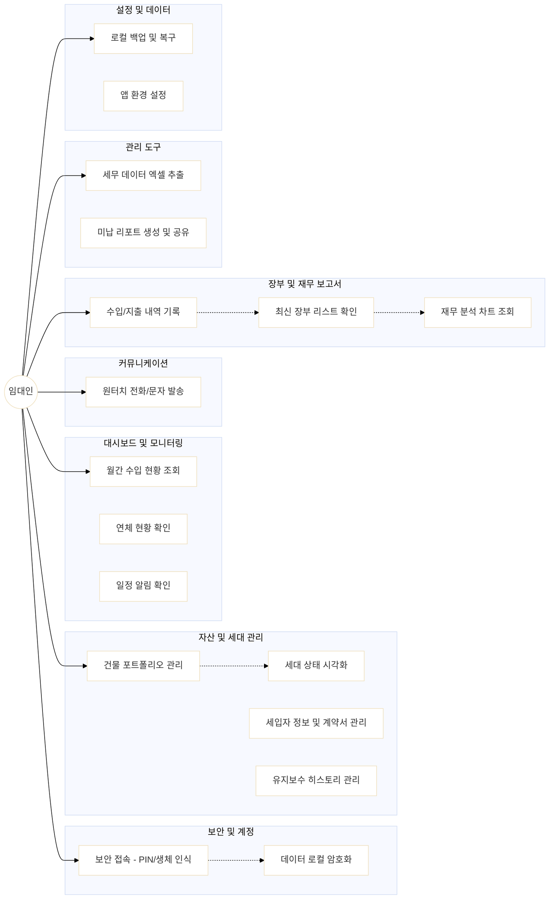

[//]: # (# SiRE &#40;Solo Investor Real Estate&#41;)

[//]: # ()
[//]: # (**SiRE**는 개인 부동산 투자자&#40;임대인&#41;를 위한 스마트한 자산 관리 및 임대 관리 솔루션입니다. 건물 정보부터 세입자 커뮤니케이션, 재무 장부까지 하나의 앱에서 통합 관리할 수 있습니다.)

[//]: # ()
[//]: # (## 👤 Primary Actor)

[//]: # (- **임대인 &#40;Landlord/User&#41;**: 건물, 세입자, 수입/지출을 관리하는 메인 사용자.)

[//]: # ()
[//]: # (## 🚀 Key Features & Use Cases)

[//]: # ()
[//]: # (### 1. 보안 및 계정 &#40;Security & Account&#41;)

[//]: # (- **보안 접속**: PIN 번호 입력을 통한 앱 잠금 기능. &#40;OS수준의 보안영역&#40;Android의 KeyStore&#41;에 저장&#41;)

[//]: # (- **데이터 로컬 저장**: 사용자 데이터를 기기 내에 암호화하여 저장하여 개인정보 보호 및 오프라인 접근 보장.)

[//]: # ()
[//]: # (### 2. 대시보드 및 모니터링 &#40;Dashboard & Monitoring&#41;)

[//]: # (- **종합 현황**: 이번 달 목표 수익 대비 수금 현황, 공실 수, 연체 현황 실시간 확인.)

[//]: # (- **스마트 알림**: 계약 만료 예정일 및 이번 주 임대료 입금 예정 건을 한눈에 파악.)

[//]: # ()
[//]: # (### 3. 자산 및 세대 관리 &#40;Property & Unit Management&#41;)

[//]: # (- **건물 포트폴리오**: 등록된 건물 목록과 각 건물의 수익률&#40;Yield&#41; 조회.)

[//]: # (- **세대 상태 시각화**: 납부 완료, 연체, 공실, 만기 임박 상태를 색상별로 구분하여 관리.)

[//]: # (- **상세 정보 관리**: 세입자 정보, 계약 기간, 보증금/월세 정보 및 계약서 이미지 관리.)

[//]: # (- **히스토리 추적**: 세대별 유지보수 기록 및 특이사항 메모를 타임라인으로 관리.)

[//]: # ()
[//]: # (### 4. 세입자 및 커뮤니케이션 &#40;Tenant & Communication&#41;)

[//]: # (- **원터치 연락**: 앱 내에서 세입자에게 즉시 전화 걸기 및 문자 메시지 발송 기능.)

[//]: # (- **문서 관리**: 임대차 계약서 및 영수증 사진을 상시 조회 가능.)

[//]: # ()
[//]: # (### 5. Ledger & Reports &#40;장부 및 보고서&#41;)

[//]: # (- **수입/지출 장부**: 카테고리별 내역 기록 및 최신순&#40;내림차순&#41; 정렬 리스트 제공.)

[//]: # (- **지출 분석**: 이번 달 지출 비중을 PieChart로 시각화 &#40;토글 방식&#41;.)

[//]: # (- **재무 분석**: 최근 6개월간의 수지 추이&#40;이중 막대 그래프&#41; 및 당해 연도 누적 결산 표 제공.)

[//]: # ()
[//]: # (### 6. Management &#40;관리 도구&#41;)

[//]: # (- **Tax Data Management**: 세무 신고를 위한 기간별 장부 내역을 엑셀&#40;.xlsx&#41;로 추출 및 공유.)

[//]: # (- **Unpaid Management**: 미납 호실 현황 리포트 생성, 이미지 공유 및 엑셀 추출 기능.)

[//]: # ()
[//]: # (### 7. 설정 및 데이터 관리 &#40;Settings&#41;)

[//]: # (- **데이터 백업**: 로컬 데이터를 백업하거나 복원하여 기기 변경 시에도 데이터 유지.)

[//]: # (- **환경 설정**: 다국어 지원&#40;20개 언어&#41; 및 통화 단위&#40;$ USD 등&#41; 설정.)

[//]: # ()
[//]: # (## 🛠 Tech Stack)

[//]: # ()
[//]: # (- **Framework**: Flutter)

[//]: # (- **State Management**: Riverpod &#40;riverpod_annotation&#41;)

[//]: # (- **Database**: Drift &#40;SQLite&#41; - 로컬 데이터 암호화 저장)

[//]: # (- **Charts**: fl_chart &#40;Grouped Bar Chart, Pie Chart&#41;)

[//]: # (- **Data Export**: excel, share_plus)

[//]: # (- **Utility**: intl, path_provider)

[//]: # ()
[//]: # (## 🏁 Use Case Diagram)

[//]: # (```mermaid)

[//]: # (%%{init: {'theme': 'base', 'themeVariables': { 'darkMode': false, 'background': '#ffffff', 'mainBkg': '#ffffff' }}}%%)

[//]: # (graph LR)

[//]: # (    User&#40;&#40;임대인&#41;&#41;)

[//]: # ()
[//]: # (    subgraph Security_Account [보안 및 계정])

[//]: # (        UC1[보안 접속 - PIN/생체 인식])

[//]: # (        UC2[데이터 로컬 암호화])

[//]: # (    end)

[//]: # ()
[//]: # (    subgraph Dashboard_Monitoring [대시보드 및 모니터링])

[//]: # (        UC3[월간 수입 현황 조회])

[//]: # (        UC4[연체 현황 확인])

[//]: # (        UC5[일정 알림 확인])

[//]: # (    end)

[//]: # ()
[//]: # (    subgraph Property_Unit [자산 및 세대 관리])

[//]: # (        UC6[건물 포트폴리오 관리])

[//]: # (        UC7[세대 상태 시각화])

[//]: # (        UC8[세입자 정보 및 계약서 관리])

[//]: # (        UC9[유지보수 히스토리 관리])

[//]: # (    end)

[//]: # ()
[//]: # (    subgraph Communication [커뮤니케이션])

[//]: # (        UC10[원터치 전화/문자 발송])

[//]: # (    end)

[//]: # ()
[//]: # (    subgraph Finance_Ledger [장부 및 재무 보고서])

[//]: # (        UC11[수입/지출 내역 기록])

[//]: # (        UC12[최신 장부 리스트 확인])

[//]: # (        UC13[재무 분석 차트 조회])

[//]: # (    end)

[//]: # ()
[//]: # (    subgraph Tools [관리 도구])

[//]: # (        UC14[세무 데이터 엑셀 추출])

[//]: # (        UC15[미납 리포트 생성 및 공유])

[//]: # (    end)

[//]: # ()
[//]: # (    subgraph Settings [설정 및 데이터])

[//]: # (        UC16[로컬 백업 및 복구])

[//]: # (        UC17[앱 환경 설정])

[//]: # (    end)

[//]: # ()
[//]: # (%% Connections)

[//]: # (    User --> UC1)

[//]: # (    User --> UC3)

[//]: # (    User --> UC6)

[//]: # (    User --> UC10)

[//]: # (    User --> UC11)

[//]: # (    User --> UC14)

[//]: # (    User --> UC16)

[//]: # ()
[//]: # (%% Logic Relations &#40;Implicit&#41;)

[//]: # (    UC1 -.-> UC2)

[//]: # (    UC6 -.-> UC7)

[//]: # (    UC11 -.-> UC12)

[//]: # (    UC12 -.-> UC13)

[//]: # (```)

[//]: # ()
[//]: # ()
[//]: # ()


# SiRE (Solo Investor Real Estate)

**SiRE**는 개인 부동산 투자자(임대인)를 위한 스마트한 자산 관리 및 임대 관리 솔루션입니다. 건물 정보부터 실시간 세입자 상태 추적, 재무 장부, 그리고 인앱 결제로 제공되는 심층 보고서까지 하나의 앱에서 통합 관리할 수 있는 강력한 로컬 기반 도구입니다.

## 👤 Primary Actor
- **임대인 (Landlord/User)**: 다수의 건물과 세대를 소무하며 효율적인 자산 운용과 정확한 재무 데이터 확보를 원하는 전문 투자자.

## 🚀 Key Features & Use Cases

### 1. 보안 및 Pro 멤버십 (Security & Entitlement)
- **PIN 보안 접속**: 앱 실행 시 PIN 번호 입력을 통해 로컬 기기에 저장된 민감한 데이터를 안전하게 보호합니다.
- **Pro 멤버십 (One-time Purchase)**:
    - **무료 체험(3회)**: Pro 전용 보고서 기능을 3회까지 미리 경험해 볼 수 있습니다.
    - **영구 소장형 인앱 결제**: 구독료 부담 없이 한 번의 구매로 보고서 추출, 무제한 데이터 관리 등 모든 Pro 기능을 평생 사용합니다.

### 2. 대시보드 및 모니터링 (Dashboard & Monitoring)
- **종합 현황 실시간 조회**: 수금 진행률(%), 공실 수, 연체 현황을 실시간 `Stream` 데이터로 확인합니다.
- **지능형 알림**: 계약 만료 예정일 및 당일 입금 예정 건을 파악하며, 미납 발생 시 대시보드 상단에 즉시 경고 배너를 표시합니다.

### 3. 자산 및 세대 관리 (Property & Unit Management)
- **건물 포트폴리오**: 등록된 건물의 총 가치와 평균 수익률(Yield)을 자동 계산합니다.
- **세대 상태 시각화**: 납부 완료, 미납(연체), 공실, 계약 만기 임박 상태를 직관적인 색상 코드로 구분합니다.
- **히스토리 추적**: 세대별 유지보수 기록 및 특이사항 메모를 타임라인 형식으로 관리합니다.
- **스마트 입력 UX**: 호실 등록 시 필수 항목(호수) 누락 시 **진동과 함께 자동 포커스 이동**, 금액 입력 시 **실시간 화폐 단위 콤마(,) 포맷팅**을 지원합니다.

### 4. 세입자 및 커뮤니케이션 (Tenant & Communication)
- **원터치 연락**: 세입자 정보에서 즉시 전화 걸기 및 문자 메시지 발송이 가능합니다.
- **연체 독촉 시스템**: 미납 발생 시 세입자 성함과 미납 금액이 포함된 SMS 템플릿을 자동으로 생성하여 빠른 수납을 유도합니다.

### 5. 장부 및 심층 보고서 (Ledger & Premium Reports)
- **하이브리드 장부**: 수입/지출 내역을 기록하고 카테고리별로 정렬하여 조회합니다.
- **지출 분석 (Pie Chart)**: 이번 달 지출 비중을 파이차트로 시각화하며 토글 방식으로 상세 내역을 확인합니다.
- **심층 재무 리포트 (Pro)**: 최근 6개월 수지 추이(이중 막대 그래프) 및 당해 연도 누적 결산 표를 제공합니다.
- **세무 데이터 엑셀 추출 (Pro)**: 세무 신고를 위한 기간별 내역 및 미납 리포트를 엑셀(.xlsx)로 추출하여 공유합니다.

### 6. 설정 및 데이터 관리 (Settings)
- **데이터 로컬 저장**: 사용자 데이터를 기기 내에 암호화하여 저장하여 개인정보 보호 및 오프라인 접근을 보장합니다.
- **글로벌 대응**: 20개국 다국어 지원 및 시스템 키(System Key) 기반 로직 적용으로 언어 변경 시에도 미납 판단의 무결성을 보장합니다.

## 🛠 Tech Stack

- **Framework**: Flutter
- **State Management**: Riverpod (riverpod_annotation)
- **Database**: Drift (SQLite) - 연쇄 삭제(Cascade) 및 관계형 데이터 관리
- **Charts**: fl_chart (Line, Bar, Pie Chart)
- **UX/UI**: HapticFeedback (진동 피드백), intl (다국어/화폐 포맷팅)

---

## 🏁 Use Case Diagram



