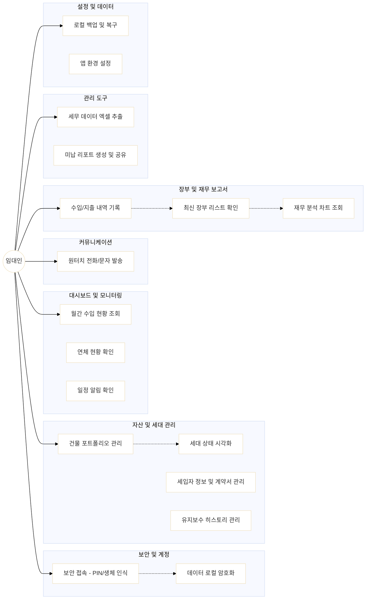

# SiRE (Solo Investor Real Estate)

**SiRE**는 개인 부동산 투자자(임대인)를 위한 스마트한 자산 관리 및 임대 관리 솔루션입니다. 건물 정보부터 세입자 커뮤니케이션, 재무 장부까지 하나의 앱에서 통합 관리할 수 있습니다.

## 👤 Primary Actor
- **임대인 (Landlord/User)**: 건물, 세입자, 수입/지출을 관리하는 메인 사용자.

## 🚀 Key Features & Use Cases

### 1. 보안 및 계정 (Security & Account)
- **보안 접속**: PIN 번호 입력 또는 Face ID(생체 인식)를 통한 앱 잠금 기능.
- **데이터 로컬 저장**: 사용자 데이터를 기기 내에 암호화하여 저장하여 개인정보 보호 및 오프라인 접근 보장.

### 2. 대시보드 및 모니터링 (Dashboard & Monitoring)
- **종합 현황**: 이번 달 목표 수익 대비 수금 현황, 공실 수, 연체 현황 실시간 확인.
- **스마트 알림**: 계약 만료 예정일 및 이번 주 임대료 입금 예정 건을 한눈에 파악.

### 3. 자산 및 세대 관리 (Property & Unit Management)
- **건물 포트폴리오**: 등록된 건물 목록과 각 건물의 수익률(Yield) 조회.
- **세대 상태 시각화**: 납부 완료, 연체, 공실, 만기 임박 상태를 색상별로 구분하여 관리.
- **상세 정보 관리**: 세입자 정보, 계약 기간, 보증금/월세 정보 및 계약서 이미지 관리.
- **히스토리 추적**: 세대별 유지보수 기록 및 특이사항 메모를 타임라인으로 관리.

### 4. 세입자 및 커뮤니케이션 (Tenant & Communication)
- **원터치 연락**: 앱 내에서 세입자에게 즉시 전화 걸기 및 문자 메시지 발송 기능.
- **문서 관리**: 임대차 계약서 및 영수증 사진을 상시 조회 가능.

### 5. Ledger & Reports (장부 및 보고서)
- **수입/지출 장부**: 카테고리별 내역 기록 및 최신순(내림차순) 정렬 리스트 제공.
- **지출 분석**: 이번 달 지출 비중을 PieChart로 시각화 (토글 방식).
- **재무 분석**: 최근 6개월간의 수지 추이(이중 막대 그래프) 및 당해 연도 누적 결산 표 제공.

### 6. Management (관리 도구)
- **Tax Data Management**: 세무 신고를 위한 기간별 장부 내역을 엑셀(.xlsx)로 추출 및 공유.
- **Unpaid Management**: 미납 호실 현황 리포트 생성, 이미지 공유 및 엑셀 추출 기능.

### 7. 설정 및 데이터 관리 (Settings)
- **데이터 백업**: 로컬 데이터를 백업하거나 복원하여 기기 변경 시에도 데이터 유지.
- **환경 설정**: 다국어 지원 및 통화 단위($ USD 등) 설정.

## 🛠 Tech Stack

- **Framework**: Flutter
- **State Management**: Riverpod (riverpod_annotation)
- **Database**: Drift (SQLite) - 로컬 데이터 암호화 저장
- **Charts**: fl_chart (Grouped Bar Chart, Pie Chart)
- **Data Export**: excel, share_plus
- **Utility**: intl, path_provider

## 🏁 Use Case Diagram

